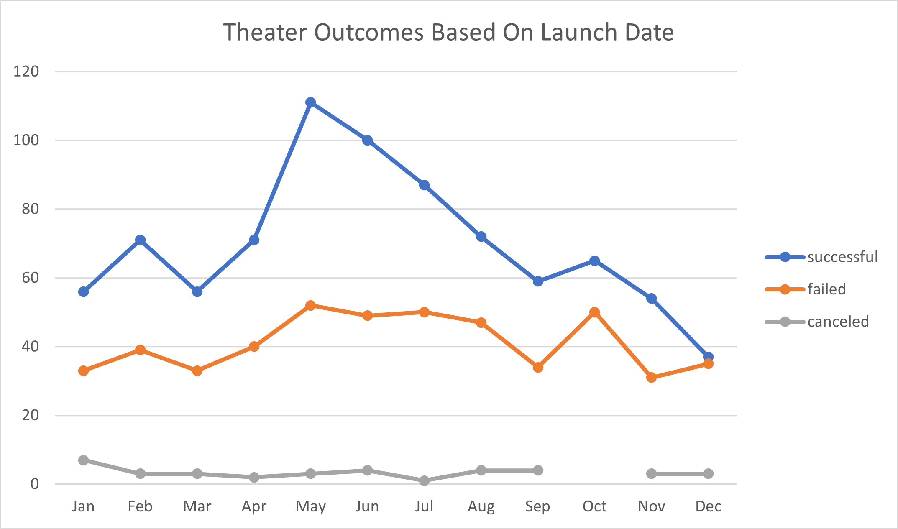
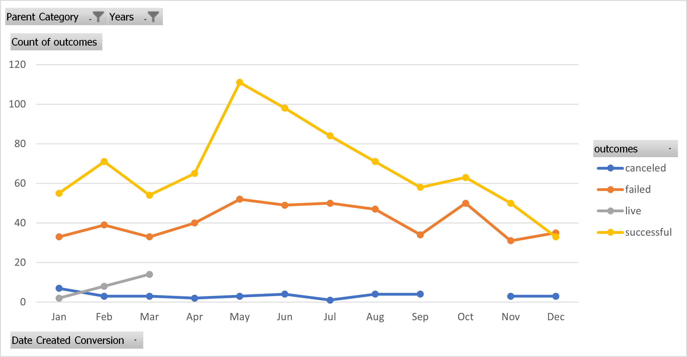
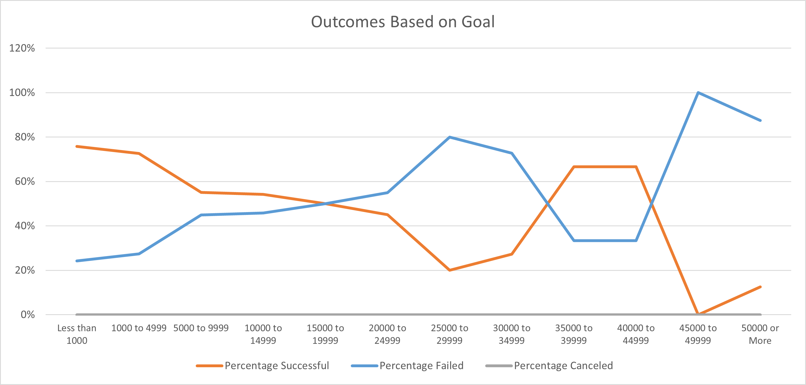
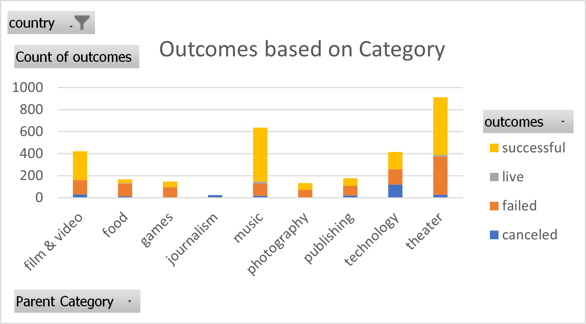
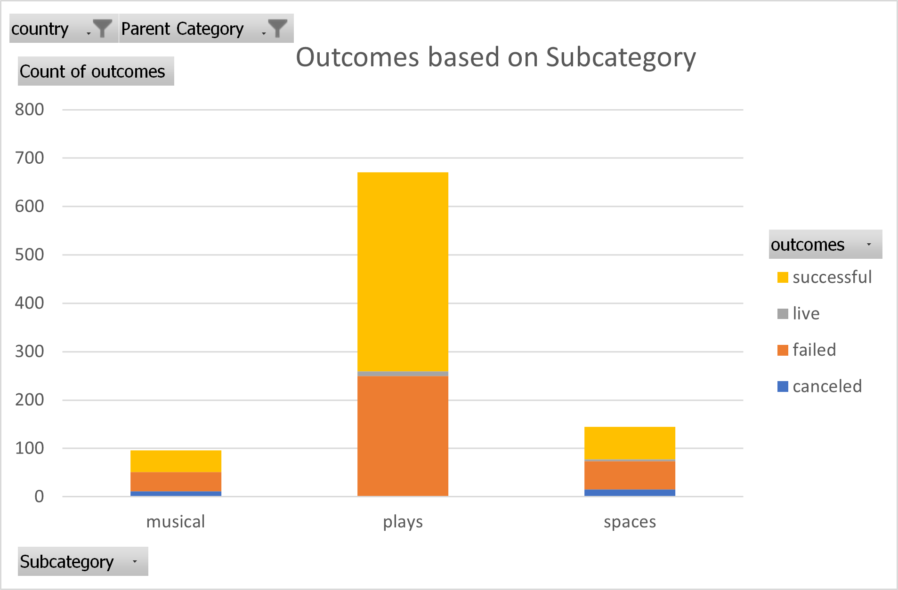

# Analyzing Kickstarter Campaigns

## Overview of Project
* This project will look at data from over four thousand different kickstarter campaigns in order to determine the optimal launch conditions, such as goal amount and launch date. This analysis will specifically focus on theater and plays.
## Analysis and Challenges
### When Should this Campaign be Launched?
* Historically, theater kickstarter campaigns have had the greatest success rate when launched during the months April through July, with May having the highest success rate of 67%. The success rate of other months is below the average of 60%, with exception of September and November at 61% success. When vewing the total number of successful, failed, and canceled theater campaigns each month, it becomes apparent that there is a large spike of successful campaigns that begins in May. While the failed campaigns also increase in the same month, this increase in not as dramatic, thus yielding May's increased success rate.

* The same trend is apparent when viewing the most recent 2014-2017 data. Summer months April through July still recieved an above average success rate, with May peaking at 67% success. Every other month performing at or below the 59% average, with exception of September and November at 60% success.

### What Goal Should be Picked?
* Lower goals tend to have a higher success rate. The $15,000 to $19,999 range has a 50% success rate, and all ranges lower than this are more likely to succeed than fail. The $35,000 to $39,999 and $40,000 to $44,999 ranges both boast a 67% success rate, though there are only nine projects in both of these ranges combined. Thus, I would not confidently say that a project is actually more likely to succeed if its goal lies within these two ranges.

### How do Theater Kickstarters Compare to Others in the United States?
* While theater is not the best performing kickstarter category in the US, its 58% success rate is above the 54% average, meaning that theater kickstarters more likely to succeed than most. Breaking down the theater category further, plays are the best performing subcategory, with a 61% success rate.
 
### Challenges
* I feel as though I could have been more efficient when using the countifs fuction to analyze outcomes based on goals. Manually inputting each criteria didn't seem to be the best use of my time, though duplicating the result of one cell throughout an entire row or column didn't yield the desired result.
* Additionally, I could not find a way to hide filters on the PivotCharts within Excel. In order to produce an image without the filters, I had to leave Excel and paste onto Microsoft Word, which also seemed inefficient.
## Results
* A campaign is most likely to succeed if launched during the summer months of April through July, with May being the most likely to succeed. If a campaign is unable to be launched during the summer months, September and November also have relatively high success rates.
* Campaigns in the lower goal ranges tend to have the greatest success rates. The lowest goal range of less than $1,000 had the highest success rate of 76%. Thus, it is best to keep the campaign goal as low as possible. The final goal range with a success rate greater than or equal to 50% is $15,000 to $19,999.
* The dataset is limited by the amount of data. When analyzing the outcomes based on goals, some higher goal ranges had higher success rates. However, there were few data points in these goal ranges, thus making the data for these ranges far less reliable. A p-value could be found to determine the reliability of this data. Another limitation of this dataset is the lack of subregion category. When looking at how kickstarters perform in the US, it would be helpful to look at how the region of the US affects campaign performance.
* It may also be of value to determine how campaign length affects campaign success. This can be done by finding the difference between the launch date and deadline of each campaign and comparing this value to campaign outcome. Additionally, instead of looking at the success rate of each goal range, one analyze the average pledge value and percent of goal pledged for each goal range.
